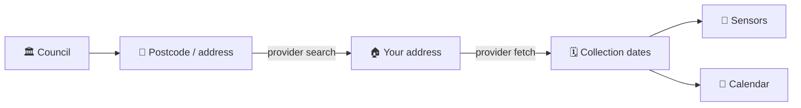

<p align="center">
  
</p>

<p align="center">
  A <b>lightweight</b> Home Assistant integration for <b>UK bin collection dates</b> —
  many councils, one integration, pure HTTP (no Selenium, no container).
</p>

<p align="center">
  <a href="https://github.com/hacs/integration"></a>
  <a href="https://github.com/Playcolors-co/ha-binhass/releases"></a>
  
  <a href="LICENSE"></a>
</p>

<p align="center">
  <a href="https://github.com/Playcolors-co/ha-binhass/actions/workflows/validate.yml"></a>
  <a href="https://github.com/Playcolors-co/ha-binhass/stargazers"></a>
  <a href="https://www.buymeacoffee.com/scattolacom"></a>
</p>

<p align="center">
  <a href="https://my.home-assistant.io/redirect/hacs_repository/?owner=Playcolors-co&repository=ha-binhass&category=integration"></a>
  <a href="https://my.home-assistant.io/redirect/config_flow_start/?domain=binhass"></a>
</p>

> [!NOTE]
> Unofficial, community-built, and free. Not affiliated with any council. It reads
> each council's own public "bin collection" service. Bin colours/services vary by
> council.

## 🇬🇧 Supported councils

Pick your council in the setup dialog. The catalog grows every release — request
yours (or send a PR to `councils.py`) via [Issues](https://github.com/Playcolors-co/ha-binhass/issues).

| Council | Backend | Data |
|---|---|---|
| Waltham Forest | AchieveForms | next date + estimated future |
| Newcastle upon Tyne | Recollect | real calendar |
| Redcar & Cleveland | Recollect | real calendar |
| Middlesbrough | Recollect | real calendar |
| Bassetlaw | Recollect | real calendar |
| Caerphilly County Borough | Recollect | real calendar |
| East Ayrshire | Recollect | real calendar |

## ♻️ What you get

A device per address with one `date` sensor per service (Refuse / Recycling /
Food / Garden / …), each holding the **next collection date**, plus a **calendar**
entity (`calendar.collections`) for a month-ahead view.

Sensor attributes: `days_until`, `round_schedule`, `service_name`, `upcoming`
(next dates), and `upcoming_estimated`.

> [!WARNING]
> Some councils' services only publish the **next** date per bin. For those, dates
> beyond the next one (in `upcoming` and the calendar) are **estimated** from the
> round frequency and don't account for bank-holiday shifts. Councils that expose a
> real calendar (e.g. Recollect) get exact future dates (`upcoming_estimated: false`).

## 🚀 Installation (HACS)

1. HACS → ⋮ → **Custom repositories** → add `https://github.com/Playcolors-co/ha-binhass`
   as an **Integration** (or click **Open in HACS** above).
2. Install **UK Bin Collection**, then restart Home Assistant.
3. **Settings → Devices & Services → Add Integration → UK Bin Collection**.
4. **Pick your council**, then enter your **postcode** (or start typing your
   **address**, depending on the council) and choose your address.

Data refreshes every 12 hours.

## 🔔 Example automation — "tomorrow's bins"

```yaml
automation:
  - alias: "Bin reminder — tomorrow"
    trigger:
      - trigger: time
        at: "19:00:00"
    variables:
      bins: "{{ states.sensor | selectattr('entity_id','search','^sensor\\.(refuse|recycling|food|garden)') | map(attribute='entity_id') | list }}"
      tomorrow: "{{ (now() + timedelta(days=1)).strftime('%Y-%m-%d') }}"
      due: >-
        {{ bins | select('is_state', tomorrow)
                | map('replace', 'sensor.', '') | map('replace', '_', ' ') | list }}
    condition:
      - condition: template
        value_template: "{{ due | count > 0 }}"
    action:
      - service: notify.notify
        data:
          message: "🗑️ Tomorrow: {{ due | join(', ') }}"
```

## ⚙️ How it works

No official nationwide API exists. Instead of driving each council's website with a
browser, this integration talks to each council's backend **directly over HTTP**.
A small set of **providers** covers many councils; a council is just data (endpoint
+ ids) mapped to a provider.



| Provider | Backend platform |
|---|---|
| `achieveforms` | Firmstep/AchieveForms `apibroker` |
| `recollect` | Recollect (`api.eu.recollect.net`) |

More providers (Whitespace, Bartec, …) and councils are added over time.

## 🙏 Credits

Council recipes are informed by the excellent, MIT-licensed
[robbrad/UKBinCollectionData](https://github.com/robbrad/UKBinCollectionData).
This project takes a deliberately lighter approach: pure async HTTP, a config flow,
and no browser/Selenium — so it covers the HTTP-friendly councils very cheaply.

## 🔒 Privacy

Your council choice and address id are stored only in your Home Assistant config
entry and sent only to that council's service. Nothing is hardcoded per user.

## ☕ Support

Free, independent work. An optional coffee is appreciated, never required:

<p align="center">
  <a href="https://www.buymeacoffee.com/scattolacom"></a>
</p>

## 📄 License

MIT — see [LICENSE](LICENSE).
